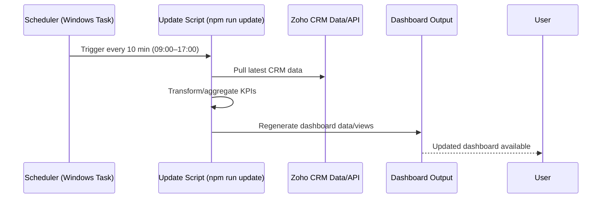

# Zoho Dashboard — Flow & Architecture

## 1) Purpose
This dashboard tracks sales performance end-to-end so you can improve revenue by focusing on conversion, velocity, and deal size.

---

## 2) High-Level Flow

```mermaid
flowchart LR
    A[Lead Sources\n(Ads, Referrals, Organic, Outbound)] --> B[Zoho CRM: Leads]
    B --> C[Qualification]
    C -->|Qualified| D[Deals/Pipeline]
    C -->|Not Qualified| X[Disqualified + Reason]
    D --> E[Activities\n(Calls, Emails, Meetings, Tasks)]
    E --> F[Stage Movement\n(Discovery → Proposal → Negotiation)]
    F -->|Won| G[Closed Won]
    F -->|Lost| H[Closed Lost + Reason]

    G --> I[Revenue KPIs]
    H --> J[Loss Analysis]
    D --> K[Pipeline KPIs]
    E --> L[Rep Performance KPIs]

    I --> M[Dashboard Widgets]
    J --> M
    K --> M
    L --> M
```

---

## 3) Architecture Components

### A. Data Layer (Zoho CRM Modules)
- **Leads**: source, campaign, industry, owner, created date
- **Contacts/Accounts**: customer context
- **Deals**: amount, stage, expected close date, owner, pipeline
- **Activities**: calls, meetings, tasks, emails
- **Products/Quotes** (optional): for average order value and upsell tracking

### B. Logic Layer (Automation + Rules)
1. **Validation Rules**
   - Mandatory: lead source, next step, expected close date, lost reason
2. **Workflow Rules**
   - No activity for X days → reminder/escalation
   - Deal in stage > threshold days → alert
   - Lost deal → require structured lost reason
3. **Scoring / Prioritization** (optional)
   - Lead score by source fit, engagement, company profile

### C. Analytics Layer (Reports)
- Lead-to-qualified conversion
- Stage-to-stage conversion
- Win rate by rep/source/industry
- Sales cycle length
- Average deal size
- Stalled deals aging report
- Forecast vs target

### D. Presentation Layer (Dashboard)
- **Executive view**: revenue, pipeline, forecast, win rate
- **Sales manager view**: rep performance, stage aging, activity gaps
- **Rep view**: open deals, next actions, overdue follow-ups

---

## 4) Dashboard Widget Blueprint

### Top KPI Cards
- Total Pipeline Value
- Closed Won (MTD)
- Win Rate (%)
- Avg Deal Size
- Sales Cycle (days)
- Activities Completed (week)

### Funnel Section
- Leads Created → Qualified → Proposal → Negotiation → Won
- Conversion % at each stage

### Pipeline Health
- Deals by stage (count + value)
- Stage aging heatmap (how long deals are stuck)
- Top stalled deals list

### Performance Breakdown
- By owner (rep leaderboard)
- By source
- By industry
- By campaign

### Loss Intelligence
- Lost reason trend
- Competitor loss map
- Price objection frequency

---

## 5) Refresh & Update Flow



---

## 6) Suggested KPI Targets for +20% Growth
- +10% more qualified opportunities
- +5% win rate improvement
- +5% average deal size uplift
- -10% cycle time reduction

> Revenue impact compounds when these improve together.

---

## 7) Operational Cadence
- **Daily:** stalled deals + overdue follow-ups
- **Weekly:** conversion by stage, rep coaching actions
- **Monthly:** source ROI, forecast accuracy, process fixes

---

## 8) File/Folder Placement
This file is saved in the dashboard project folder:
- `E:\Dashboard\DASHBOARD_FLOW_ARCHITECTURE.md`
